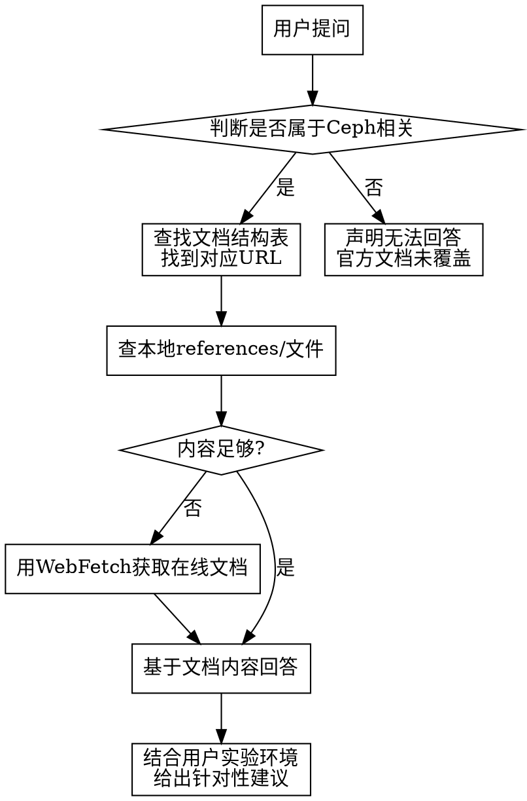

# Ceph 文档参考 Skill

## 铁律

**本 Skill 所有回答必须基于 https://docs.ceph.net.cn/en/latest/ 官方文档内容。**

- 不允许编造、猜测或引用文档中不存在的内容
- 优先使用本地参考文件（`references/` 目录下）获取文档内容
- 如本地参考文件不足，尝试用 `WebFetch` 工具获取官方文档原文
- 如果文档未覆盖某场景，明确告知用户"官方文档未涉及此内容"
- 不要自作主张添加官方没有的建议或配置参数
- 不要偏离轨道去解决文档范围之外的问题
- 回答末尾必须标注信息来源（章节名 + URL）

## 用户实验环境

```
宿主机: Windows + VMware Workstation
集群:   3节点 OpenCloudOS 8.10
        Ceph Pacific 16.2.15 (手动部署, 非cephadm)
        OVS 3.3.9 (源码编译, 双桥: br0管理+存储, ovs-vm虚拟机网络)
        KVM: node129 上运行 VM linux2024 (192.168.48.149, RBD启动盘)
        日志: CephFS 三节点直写 /mnt/kvm_logs/

节点详情:
┌─────────┬────────────────┬───────────────┬──────────────────────────────┐
│  节点   │       IP       │   存储私网    │            角色              │
├─────────┼────────────────┼───────────────┼──────────────────────────────┤
│ node129 │ 192.168.48.129 │ 192.168.12.15 │ mon, mgr, osd.0/1, KVM 宿主机│
│ node144 │ 192.168.48.144 │ 192.168.12.16 │ mon, osd.2/3                 │
│ node145 │ 192.168.48.145 │ 192.168.12.17 │ mon, osd.4/5                 │
└─────────┴────────────────┴───────────────┴──────────────────────────────┘

存储: 6 OSD，每节点 2×25G HDD + 1×10G NVMe WAL/DB
版本: Ceph Pacific 16.2.15
```

**在回答用户问题时，结合此环境给出针对性建议。但所有建议必须源自官方文档。**

## 文档结构速查

官方文档顶级章节及对应 URL：

| 章节 | URL |
|------|-----|
| Ceph 简介 | https://docs.ceph.net.cn/en/latest/start/ |
| 安装 Ceph | https://docs.ceph.net.cn/en/latest/install/ |
| 手动安装 | https://docs.ceph.net.cn/en/latest/install/index_manual/ |
| Cephadm | https://docs.ceph.net.cn/en/latest/cephadm/ |
| Cephadm 安装 | https://docs.ceph.net.cn/en/latest/cephadm/install/ |
| Cephadm 运维 | https://docs.ceph.net.cn/en/latest/cephadm/operations/ |
| Cephadm 故障 | https://docs.ceph.net.cn/en/latest/cephadm/troubleshooting/ |
| 存储集群(RADOS) | https://docs.ceph.net.cn/en/latest/rados/ |
| RADOS 配置 | https://docs.ceph.net.cn/en/latest/rados/configuration/ |
| RADOS 运维 | https://docs.ceph.net.cn/en/latest/rados/operations/ |
| RADOS 故障 | https://docs.ceph.net.cn/en/latest/rados/troubleshooting/ |
| RBD 块设备 | https://docs.ceph.net.cn/en/latest/rbd/ |
| RBD 运维 | https://docs.ceph.net.cn/en/latest/rbd/rbd-operations/ |
| RBD 命令 | https://docs.ceph.net.cn/en/latest/rbd/rados-rbd-cmds/ |
| CephFS 文件系统 | https://docs.ceph.net.cn/en/latest/cephfs/ |
| CephFS 创建 | https://docs.ceph.net.cn/en/latest/cephfs/createfs/ |
| CephFS 管理 | https://docs.ceph.net.cn/en/latest/cephfs/administration/ |
| MDS 增删 | https://docs.ceph.net.cn/en/latest/cephfs/add-remove-mds/ |
| RADOSGW 网关 | https://docs.ceph.net.cn/en/latest/radosgw/ |
| RGW 管理 | https://docs.ceph.net.cn/en/latest/radosgw/admin/ |
| Mgr 管理器 | https://docs.ceph.net.cn/en/latest/mgr/ |
| Dashboard | https://docs.ceph.net.cn/en/latest/mgr/dashboard/ |
| 监控 | https://docs.ceph.net.cn/en/latest/monitoring/ |
| 安全 | https://docs.ceph.net.cn/en/latest/security/ |
| 架构 | https://docs.ceph.net.cn/en/latest/architecture/ |
| ceph-volume | https://docs.ceph.net.cn/en/latest/ceph-volume/ |
| 版本说明 | https://docs.ceph.net.cn/en/latest/releases/ |
| 术语表 | https://docs.ceph.net.cn/en/latest/glossary/ |

### RADOS 子章节 (rados/operations/)

| 子页面 | URL |
|--------|-----|
| 监控器 | https://docs.ceph.net.cn/en/latest/rados/operations/monitoring/ |
| OSD | https://docs.ceph.net.cn/en/latest/rados/operations/osd/ |
| PG | https://docs.ceph.net.cn/en/latest/rados/operations/placement-groups/ |
| 纠删码 | https://docs.ceph.net.cn/en/latest/rados/operations/erasure-code/ |
| CRUSH | https://docs.ceph.net.cn/en/latest/rados/operations/crush-map/ |
| 添加/删除 OSD | https://docs.ceph.net.cn/en/latest/rados/operations/add-or-rm-osds/ |
| 数据均衡 | https://docs.ceph.net.cn/en/latest/rados/operations/balancer/ |
| 数据校验 | https://docs.ceph.net.cn/en/latest/rados/operations/data-check/ |
| 用户管理 | https://docs.ceph.net.cn/en/latest/rados/operations/user-management/ |
| 缓存分层 | https://docs.ceph.net.cn/en/latest/rados/operations/cache-tiering/ |
| 清洗 | https://docs.ceph.net.cn/en/latest/rados/operations/scrub/ |
| 蓝屏/烈焰 | https://docs.ceph.net.cn/en/latest/rados/operations/blue-store-migration/ |
| 控制 | https://docs.ceph.net.cn/en/latest/rados/operations/control/ |

## 架构核心概念 (摘自官方文档)

**Ceph 存储集群** 基于 **RADOS**（Reliable Autonomic Distributed Object Store）。

**核心组件:**
- **Ceph Monitor (mon)** — 维护集群映射主副本，集群仲裁
- **Ceph OSD Daemon (osd)** — 数据存储、复制、恢复、再均衡
- **Ceph Manager (mgr)** — 监控、编排、插件模块端点
- **Ceph Metadata Server (mds)** — CephFS 元数据管理

**CRUSH 算法:** 客户端和 OSD 使用 CRUSH 计算数据位置，无需中心查找表。CRUSH 使用智能数据复制确保弹性。

**数据存储:** 数据以 RADOS 对象存储在 OSD 上。默认 BlueStore 后端。对象 ID 集群唯一。每个对象有标识符、二进制数据、元数据（名称/值对）。

**集群映射:** 包含 5 个映射：Monitor Map、OSD Map、PG Map、CRUSH Map、MDS Map

## 使用方式

当用户提问时，按以下流程操作：



**具体步骤：**
1. 根据问题内容，在"文档结构速查"表中找到最相关的 URL
2. 优先查阅 `references/` 目录下的本地参考文件
3. 如本地参考不足，尝试用 `WebFetch` 获取该 URL 的文档内容
4. 从文档中提取与问题相关的部分
5. 基于文档内容组织回答
6. 结合用户的实验环境给出针对性建议
7. 在回答末尾注明信息来源的 URL

## 引用格式

回答时必须明确标注信息来源：
```
> 来源: [Ceph 官方文档 - 章节名](https://docs.ceph.net.cn/en/latest/XXXX/)
```

## 常见场景速查

### 安装相关
```
手动部署参考: https://docs.ceph.net.cn/en/latest/install/index_manual/
cephadm 部署: https://docs.ceph.net.cn/en/latest/cephadm/install/
ceph-volume:  https://docs.ceph.net.cn/en/latest/ceph-volume/
```

### 运维命令
```
集群状态:   ceph -s
OSD 树:     ceph osd tree
PG 状态:    ceph pg stat
监控器状态: ceph mon stat
Mgr 状态:   ceph mgr stat
```

## 已知的用户实验记录

用户已有以下实验记录（Xshell 终端实录格式），回答时可参考：
- Ceph Pacific 16.2.15 手动部署全流程
- OVS 3.3.9 源码编译部署
- mgr 迁移实验
- OSD 故障恢复实验
- 防火墙策略与 SELinux 配置
- RBD → CephFS 日志架构演进
- KVM 虚拟机 RBD 启动盘配置

## 错误处理

| 用户问题类型 | 处理方式 |
|-------------|---------|
| 文档中能找到的内容 | 查本地参考文件或 WebFetch 获取原文后回答 |
| 文档中与用户环境冲突 | 以文档为准，指出差异 |
| 文档中未覆盖 | 明确告知未覆盖，提供已知参考 |
| 非 Ceph 相关 | 礼貌告知本 Skill 范围，建议其他资源 |

## 本地参考文件索引

`references/` 目录下包含从官方文档提取的文本内容：

| 文件 | 内容 | 大小 |
|------|------|------|
| `architecture.txt` | Ceph 架构 — RADOS、CRUSH、核心组件 | 41KB |
| `install_manual.txt` | 手动安装步骤 | 2.6KB |
| `cephadm_install.txt` | Cephadm 安装指南 | 18KB |
| `cephadm_ops.txt` | Cephadm 运维操作 | 26KB |
| `cephadm_trouble.txt` | Cephadm 故障排查 | 16KB |
| `rados_config.txt` | RADOS 配置参考 | 2.3KB |
| `rados_ops.txt` | RADOS 运维操作概览 | 3KB |
| `rados_trouble.txt` | RADOS 故障排查 | 1.5KB |
| `rbd_cmds.txt` | RBD 命令参考 | 7.8KB |
| `rbd_ops.txt` | RBD 运维操作 | 1.4KB |
| `cephfs_create.txt` | CephFS 创建指南 | 7.7KB |
| `cephfs_admin.txt` | CephFS 管理维护 | 14KB |
| `cephfs_mds.txt` | MDS 添加/删除 | 6.3KB |
| `rgw_admin.txt` | RADOSGW 管理操作 | 29KB |
| `security.txt` | 安全配置 | 1.6KB |
| `glossary.txt` | 术语表 | 13KB |
